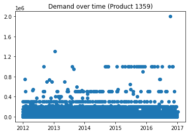
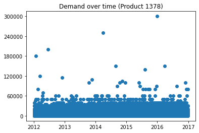

# EECS 731 - Project 5 (Forecasting)
### Author: Jace Kline

## Objective
Given a dataset associating products and their demands over time, we shall use data cleaning, feature engineering, and model selection for predicting the demand of any particular product in the dataset.


```python
import os
import sys
sys.path.append('../src/')
from initial_transform import transform_write

# General imports
import re
import numpy as np
import pandas as pd
from matplotlib import pyplot as plt
%matplotlib inline
```

## Loading the Initial Data
First, we shall load the initial dataset from the CSV file. As we can see, there are over a million rows.


```python
init_data = '../data/initial/product_demand.csv'
df = pd.read_csv(init_data)
df
```


<div>
<table border="1" class="dataframe">
  <thead>
    <tr style="text-align: right;">
      <th></th>
      <th>Product_Code</th>
      <th>Warehouse</th>
      <th>Product_Category</th>
      <th>Date</th>
      <th>Order_Demand</th>
    </tr>
  </thead>
  <tbody>
    <tr>
      <th>0</th>
      <td>Product_0993</td>
      <td>Whse_J</td>
      <td>Category_028</td>
      <td>2012/7/27</td>
      <td>100</td>
    </tr>
    <tr>
      <th>1</th>
      <td>Product_0979</td>
      <td>Whse_J</td>
      <td>Category_028</td>
      <td>2012/1/19</td>
      <td>500</td>
    </tr>
    <tr>
      <th>2</th>
      <td>Product_0979</td>
      <td>Whse_J</td>
      <td>Category_028</td>
      <td>2012/2/3</td>
      <td>500</td>
    </tr>
    <tr>
      <th>3</th>
      <td>Product_0979</td>
      <td>Whse_J</td>
      <td>Category_028</td>
      <td>2012/2/9</td>
      <td>500</td>
    </tr>
    <tr>
      <th>4</th>
      <td>Product_0979</td>
      <td>Whse_J</td>
      <td>Category_028</td>
      <td>2012/3/2</td>
      <td>500</td>
    </tr>
    <tr>
      <th>...</th>
      <td>...</td>
      <td>...</td>
      <td>...</td>
      <td>...</td>
      <td>...</td>
    </tr>
    <tr>
      <th>1048570</th>
      <td>Product_1791</td>
      <td>Whse_J</td>
      <td>Category_006</td>
      <td>2016/4/27</td>
      <td>1000</td>
    </tr>
    <tr>
      <th>1048571</th>
      <td>Product_1974</td>
      <td>Whse_J</td>
      <td>Category_006</td>
      <td>2016/4/27</td>
      <td>1</td>
    </tr>
    <tr>
      <th>1048572</th>
      <td>Product_1787</td>
      <td>Whse_J</td>
      <td>Category_006</td>
      <td>2016/4/28</td>
      <td>2500</td>
    </tr>
    <tr>
      <th>1048573</th>
      <td>Product_0901</td>
      <td>Whse_J</td>
      <td>Category_023</td>
      <td>2016/10/7</td>
      <td>50</td>
    </tr>
    <tr>
      <th>1048574</th>
      <td>Product_0704</td>
      <td>Whse_J</td>
      <td>Category_001</td>
      <td>2016/6/27</td>
      <td>4</td>
    </tr>
  </tbody>
</table>
<p>1048575 rows × 5 columns</p>
</div>


## Initial Preprocessing
To clean up the dataset, we shall do the following:
1. Map each 'Product_Code' and 'Product_Category'feature to an integer type
    * This will drastically decrease the space and time overhead of storing and querying these features
2. Drop the Warehouse feature
    * The warehouse that a product is produced in is not relevant to the demand of the product
3. Shorten the feature names
4. Map the 'Order_Demand' feature to an integer type
5. Drop NaN values

To save time when re-running this notebook, we utilize script that achieves these preprocessing tasks and outputs them to a new dataset file. See [this file](../src/initial_transform.py) for the source code.

Below, we show the relevant source code for transforming the original dataset.
```python
write_loc = '../data/intermediate/data.csv'

def prod_code(row):
    c = str(row['Product_Code'])
    # Parse
    m = re.search('Product_([0-9]+)', c)
    n = m.group(1)
    return int(n) if n is not None else np.nan

def prod_category(row):
    c = str(row['Product_Category'])
    # Parse
    m = re.search('Category_([0-9]+)', c)
    n = m.group(1)
    return int(n) if n is not None else np.nan

def clean_demand(row):
    c = str(row['Order_Demand'])
    m = re.search('[(]?([0-9]+)[)]?', c)
    n = m.group(1)
    return int(n) if n is not None else np.nan


def transform_write(df):
    df['Product_Code'] = df.apply(prod_code, axis=1)
    df['Product_Category'] = df.apply(prod_category, axis=1)
    df['Order_Demand'] = df.apply(clean_demand, axis=1)
    df = df.drop('Warehouse',axis=1)
    df = df.rename(columns={'Product_Code':'code', 'Product_Category':'category', 'Date':'date', 'Order_Demand':'demand'})
    df = df.dropna(axis=0)
    df.to_csv(write_loc, index=False)
```

Note: We must run the transform() function in this script if the transformed data hasn't been generated yet. See below.


```python
override = False
if not(os.path.exists('../data/intermediate/data.csv')) or override:
    transform_write(df)
```

## Loading the Preprocessed Data
Since the dataset we are working with contains over a million rows, we have already generated the preprocessed data from our sctipt above and will simply load in the transformed data.


```python
df = pd.read_csv('../data/intermediate/data.csv')
```

### Converting the 'Date' column to DateTime object
For Pandas to be able to utilize the 'Date' field in our dataset, we shall first convert the 'Data' column entries from strings into DateTime objects.


```python
df['date'] = pd.to_datetime(df['date'])
df
```


<div>
<table border="1" class="dataframe">
  <thead>
    <tr style="text-align: right;">
      <th></th>
      <th>code</th>
      <th>category</th>
      <th>date</th>
      <th>demand</th>
    </tr>
  </thead>
  <tbody>
    <tr>
      <th>0</th>
      <td>993</td>
      <td>28</td>
      <td>2012-07-27</td>
      <td>100</td>
    </tr>
    <tr>
      <th>1</th>
      <td>979</td>
      <td>28</td>
      <td>2012-01-19</td>
      <td>500</td>
    </tr>
    <tr>
      <th>2</th>
      <td>979</td>
      <td>28</td>
      <td>2012-02-03</td>
      <td>500</td>
    </tr>
    <tr>
      <th>3</th>
      <td>979</td>
      <td>28</td>
      <td>2012-02-09</td>
      <td>500</td>
    </tr>
    <tr>
      <th>4</th>
      <td>979</td>
      <td>28</td>
      <td>2012-03-02</td>
      <td>500</td>
    </tr>
    <tr>
      <th>...</th>
      <td>...</td>
      <td>...</td>
      <td>...</td>
      <td>...</td>
    </tr>
    <tr>
      <th>1037331</th>
      <td>1791</td>
      <td>6</td>
      <td>2016-04-27</td>
      <td>1000</td>
    </tr>
    <tr>
      <th>1037332</th>
      <td>1974</td>
      <td>6</td>
      <td>2016-04-27</td>
      <td>1</td>
    </tr>
    <tr>
      <th>1037333</th>
      <td>1787</td>
      <td>6</td>
      <td>2016-04-28</td>
      <td>2500</td>
    </tr>
    <tr>
      <th>1037334</th>
      <td>901</td>
      <td>23</td>
      <td>2016-10-07</td>
      <td>50</td>
    </tr>
    <tr>
      <th>1037335</th>
      <td>704</td>
      <td>1</td>
      <td>2016-06-27</td>
      <td>4</td>
    </tr>
  </tbody>
</table>
<p>1037336 rows × 4 columns</p>
</div>


## Data Exploration
We shall start exploration by answering the following questions:
1. How many different products (and how many times does each appear)?
2. How many categories (and how many times does each appear)?
3. Which products should we use in our forecasting?
   * We should aim to use the products with the highest product count


```python
def unique_counts_sorted(colname):
    df_tmp = pd.DataFrame(np.transpose(np.unique(df[colname], return_counts=True)), columns=[colname, 'Count'])
    df_tmp = df_tmp.sort_values(['Count', colname], ascending=[False, True])
    return df_tmp
```

### Top Product Counts
We shall use these top 3 products in our forecasting because they contain the most number of sample data points to use for training and testing.


```python
tmp = unique_counts_sorted('code').head(3)

# Store the desired product codes to use for our models
codes = list(tmp['code'])

# Define the associated dataframes to these product codes
code_dfs = list(map(lambda n : df[df['code'] == n], codes))

tmp
#code_dfs
```


<div>
<table border="1" class="dataframe">
  <thead>
    <tr style="text-align: right;">
      <th></th>
      <th>code</th>
      <th>Count</th>
    </tr>
  </thead>
  <tbody>
    <tr>
      <th>1348</th>
      <td>1359</td>
      <td>16936</td>
    </tr>
    <tr>
      <th>1284</th>
      <td>1295</td>
      <td>10575</td>
    </tr>
    <tr>
      <th>1367</th>
      <td>1378</td>
      <td>9770</td>
    </tr>
  </tbody>
</table>
</div>


### Top Category Counts
We see that almost half of the rows fall into product category 19.


```python
unique_counts_sorted('category').head(3)
```


<div>
<table border="1" class="dataframe">
  <thead>
    <tr style="text-align: right;">
      <th></th>
      <th>category</th>
      <th>Count</th>
    </tr>
  </thead>
  <tbody>
    <tr>
      <th>18</th>
      <td>19</td>
      <td>470266</td>
    </tr>
    <tr>
      <th>4</th>
      <td>5</td>
      <td>101627</td>
    </tr>
    <tr>
      <th>0</th>
      <td>1</td>
      <td>97787</td>
    </tr>
  </tbody>
</table>
</div>


### Demand Statistics for top products
Below, we compute the mininum, maximum, mean, and median for the demand of each of the top products.


```python
l = []
for code, df_ in zip(codes,code_dfs):
    demand = df_['demand']
    l.append([code, demand.min(), demand.max(), demand.mean(), demand.median()])

demand_stats = pd.DataFrame(l, columns=['code', 'min', 'max', 'mean', 'median'])
demand_stats
```


<div>
<table border="1" class="dataframe">
  <thead>
    <tr style="text-align: right;">
      <th></th>
      <th>code</th>
      <th>min</th>
      <th>max</th>
      <th>mean</th>
      <th>median</th>
    </tr>
  </thead>
  <tbody>
    <tr>
      <th>0</th>
      <td>1359</td>
      <td>0</td>
      <td>2000000</td>
      <td>27897.614549</td>
      <td>10000.0</td>
    </tr>
    <tr>
      <th>1</th>
      <td>1295</td>
      <td>0</td>
      <td>400000</td>
      <td>11659.858156</td>
      <td>6000.0</td>
    </tr>
    <tr>
      <th>2</th>
      <td>1378</td>
      <td>0</td>
      <td>300000</td>
      <td>8560.153531</td>
      <td>5000.0</td>
    </tr>
  </tbody>
</table>
</div>


### Observing 'demand vs date' for top products
To gain some intuition behind our data, we shall plot the demand of the top products against the date associated. 

We observe the following:
* most of the 'demand' data points lie near the bottom of the range for each product
* the data points tend to repeat on well-defined 'demand' values


```python
def get_ticks_range(series, numticks):
    mn = series.min()
    mx = series.max()
    delta = int((mx - mn) / (numticks - 1))
    return np.arange(mn, mx+1, step=delta)
```


```python
for code, df_ in zip(codes,code_dfs):
    plt.scatter(df_['date'], df_['demand'], label=str(code))
    plt.yticks(get_ticks_range(df_['demand'], 6))
    plt.title("Demand over time (Product {})".format(code))
    plt.show()
```








### Grouping Demand by Month
Although the above outputs are interesting, the large number of data points makes it extremely difficult to obtain a clear sense of what trends are occurring in the data. To reduce some complexity, we shall group the demand of each of the top products by month and then plot the resulting demand averages.


```python
def demand_by_month(df):
    df_ = df.sort_values('date', ascending=True).reset_index()
    basedate = df_.loc[0,'date']
    df_['yearmonth'] = df_['date'] - pd.offsets.MonthBegin(1)
    df_['yearmonth'] = df_['yearmonth'].apply(lambda x: '{year}-{month}'.format(year=x.year, month=x.month))
    return df_.groupby('yearmonth').mean().drop(['index','code','category'],axis=1).reset_index()

def prod_monthly_demands(df_):
    df_ = demand_by_month(df_)
    df_['yearmonth'] = pd.to_datetime(df_['yearmonth'])
    df_ = df_.sort_values(by='yearmonth', ascending=True)
    return df_
```

#### Individual View
Below, we display each of the top products' average demand per year and month.


```python
for code, df_ in zip(codes, code_dfs):
    df_ = prod_monthly_demands(df_)
    plt.plot(df_['yearmonth'], df_['demand'], label=(str(code)))
    plt.title('Demand vs Year Month (Product {})'.format(code))
    plt.show()
```


#### Aggregate View
In the following figure, we plot all of the above on the same graph to show the relative differences in demand over time.


```python
for code, df_ in zip(codes, code_dfs):
    df_ = prod_monthly_demands(df_)
    plt.plot(df_['yearmonth'], df_['demand'], label=(str(code)))

plt.legend()
plt.title('Demand vs Year Month')
plt.show()
```


As we can see from above, the 2017 January average demand is a large jump from the previous months. To remedy the problem of outliers, we shall use an approach to identify and remove outliers.

## Final Dataset Engineering and Cleanup
Now that we have performed data analysis and exploration, we can clean up our datasets to prepare for fitting and testing with models. We will do the following:
1. Sort the datasets by 'date'
2. Reindex the datasets
3. Drop unnecessary columns, namely the 'code' and 'category' columns
4. For duplicate 'demand' values on a date, average the values and reduce to a single row
5. Remove outliers from each product's dataset
6. Convert each dataframe to a series with the date as the index

### Sorting and Reindexing
First we shall sort, reindex, and drop unnecessary columns for each of the product datasets.


```python
def lookup_index(x, l):
    for i, y in zip(range(0,len(l)+1), l):
        if x == y:
            return i
    return None
```


```python
# Overwrite the old versions of each product's dataset
code_dfs = list(map(lambda df: df.sort_values('date').reset_index().drop(['code', 'category', 'index'], axis=1),code_dfs))
```

### Aggregating Duplicates
For each duplicate date in our datasets, we shall reduce these 'demand' entries to one row that contains the average of all of these. This is because we cannot discern which of the 'demand' values is supposed to appear first in our time series.


```python
def aggregate_dups(df):
    return df.groupby(by='date').mean()
```


```python
code_dfs = list(map(aggregate_dups, code_dfs))
```

### Dropping NaN values


```python
code_dfs = list(map(lambda df: df.dropna(how='any'), code_dfs))
```

### Removing Outliers
We will use SciKit-Learn's LocalOutlierFactor class to remove outliers from each of our product datasets. This will help to improve the validity and accuracy of our models.


```python
from sklearn.neighbors import LocalOutlierFactor
```


```python
def remove_outliers(df):
    lof = LocalOutlierFactor()
    yhat = lof.fit_predict(df['demand'].to_numpy().reshape(-1,1))
    mask = (yhat != -1)
    return df[mask]

def map_rows(dfs):
    return list(map(lambda df: len(df), dfs))
```


```python
rows_before = map_rows(code_dfs)
# Remove outliers from each product's dataset
code_dfs = list(map(remove_outliers, code_dfs))
rows_after = map_rows(code_dfs)

for code, before, after in zip(codes, rows_before, rows_after):
    print("Product {}:".format(code))
    print("Rows before outlier removal: {}".format(before))
    print("Rows after outlier removal: {}".format(after))
    print("Percentage of entries removed: {:.2f}%\n".format(((before - after) / before) * 100))
```

    Product 1359:
    Rows before outlier removal: 1232
    Rows after outlier removal: 1217
    Percentage of entries removed: 1.22%
    
    Product 1295:
    Rows before outlier removal: 1217
    Rows after outlier removal: 1210
    Percentage of entries removed: 0.58%
    
    Product 1378:
    Rows before outlier removal: 1221
    Rows after outlier removal: 1205
    Percentage of entries removed: 1.31%
    


### Converting to Time Series
Now we must turn our product dataframes into time series objects for use in our model creation and utilization.


```python
sers = list(map(lambda df: df['demand'],code_dfs))

# example
sers[0]
```


    date
    2012-01-05     43875.000000
    2012-01-06     33800.000000
    2012-01-10     32625.000000
    2012-01-11     10000.000000
    2012-01-12     16705.882353
                      ...      
    2016-12-22     22500.000000
    2016-12-26     23833.333333
    2016-12-27     15000.000000
    2016-12-28     20000.000000
    2017-01-06    100000.000000
    Name: demand, Length: 1217, dtype: float64


## Preparing Data for Model Fitting
In order to produce a precise and accurate model, we must first attempt to increase the **stationarity** of our product series. To achieve a **stationary** data series, we must keep the statistical measures like mean, variance, etc. constant over the entirety of the time series. In short, we want to keep constant change in statistical measures over time, but not the values of the data themselves. For example, we want the change (delta) in mean and variance to stay constant over time, but the mean and variance of the raw data can change. We will use the **Dickey-Fuller test** to test a series for stationarity.

### Define a Stationarity Test
For each of the target products, we shall use the Dickey-Fuller test and output a graph of results such as the rolling average and rolling standard deviation. For each test we start with the null hypothesis that the test is not stationary. If we observe that the p-value is less than 0.05 for a test, then we shall reject the null hypothesis and therefore we declare that the test is stationary. I give credit to [this article](https://medium.com/@stallonejacob/time-series-forecast-a-basic-introduction-using-python-414fcb963000) for inspiration and examples.


```python
from statsmodels.tsa.stattools import adfuller
```


```python
def test_stationarity(series):
    rolmean = series.rolling(window=12).mean()
    rolstd = series.rolling(window=12).std()
    
    # Show the series, rolling average, and rolling standard deviation
    plt.plot(series, label='Original Series')
    plt.plot(rolmean, label='Rolling Average')
    plt.plot(rolstd, label='Rolling StdDev')
    plt.legend(loc='best')
    plt.show()
    
    # Dickey-Fuller test
    test = adfuller(series, autolag='AIC')
    
    # Print test results
    test_output = pd.Series(test[0:4], index=['Test Statistic','p-value','#Lags Used','Number of Observations Used'])
    for k,v in test[4].items():
        test_output['Critical Value (%s)'%k] = v
    print(test_output)
    print('Is Stationary?: {}'.format(test[1] < 0.05))
    
def stationarity_of_product(code):
    plt.title('Stationarity Test (Product {})'.format(code))
    test_stationarity(sers[lookup_index(code, codes)])
```

### Determining Stationarity of our Data
Now that we have defined a test and test output, we can run this test on our datasets to determine stationarity. As we see below, all of the tests pass the test of 95% confidence. Hence, we may use them directly in our models.


```python
for code in codes:
    stationarity_of_product(code)
```


    Test Statistic                  -34.921309
    p-value                           0.000000
    #Lags Used                        0.000000
    Number of Observations Used    1216.000000
    Critical Value (1%)              -3.435739
    Critical Value (5%)              -2.863920
    Critical Value (10%)             -2.568037
    dtype: float64
    Is Stationary?: True


    Test Statistic                   -3.086376
    p-value                           0.027578
    #Lags Used                       23.000000
    Number of Observations Used    1186.000000
    Critical Value (1%)              -3.435876
    Critical Value (5%)              -2.863980
    Critical Value (10%)             -2.568069
    dtype: float64
    Is Stationary?: True


    Test Statistic                  -22.707101
    p-value                           0.000000
    #Lags Used                        1.000000
    Number of Observations Used    1203.000000
    Critical Value (1%)              -3.435797
    Critical Value (5%)              -2.863946
    Critical Value (10%)             -2.568051
    dtype: float64
    Is Stationary?: True


### Adding Frequency Information to Each Series
For our models to function properly, we must add a frequency measure to each series. This will convert the Datetime index to a Period index for each series. We make the period 'D' for 'days'.


```python
sers = list(map(lambda ser: ser.asfreq(freq='D', method='ffill'), sers))

sers[0].index
```


    DatetimeIndex(['2012-01-05', '2012-01-06', '2012-01-07', '2012-01-08',
                   '2012-01-09', '2012-01-10', '2012-01-11', '2012-01-12',
                   '2012-01-13', '2012-01-14',
                   ...
                   '2016-12-28', '2016-12-29', '2016-12-30', '2016-12-31',
                   '2017-01-01', '2017-01-02', '2017-01-03', '2017-01-04',
                   '2017-01-05', '2017-01-06'],
                  dtype='datetime64[ns]', name='date', length=1829, freq='D')


## Constructing Models
Now that we have ensured our time series data is stationary for each product, we shall proceed to choose models to test against our datasets. We will utilize the ARMA and Hidden Markov models from the statsmodels library.

### Importing Necessary Modules


```python
from statsmodels.tsa.arima_model import ARIMA
from statsmodels.tsa.regime_switching.markov_autoregression import MarkovAutoregression
```

### Splitting the Data
We must split the data into our training and testing datasets. Because we are testing multiple models with multiple products and this will get computationally expensive, we will simply split the data by taking the first 90% for training and the last 10% for testing.


```python
def split_90_10(ser):
    l = len(ser)
    i = int(l * 0.9)
    return (ser[:i], ser[i:])

splits = list(map(split_90_10, sers))
trains = list(map(lambda x: x[0], splits))
tests = list(map(lambda x: x[1], splits))
```

### ARMA Model
Since we have already shown that our data is stationary, we can use an ARMA model. This is a particular form of an ARIMA model where the order of the difference is 0.


```python
def absdiff(x, y):
    z = x - y
    return z if z >= 0 else (-1 * z)
```


```python
def test_model(model, code, predict=True):
    i = lookup_index(code, codes)
    k = len(trains[i])
    l = len(sers[i]) - k
    
    # Create model and fit with training data
    fit = model.fit()
    
    # Plot model over original data
    plt.plot(trains[i], label='Actual')
    plt.plot(fit.fittedvalues, label='Model')
    plt.title("Model (Product {})".format(code))
    plt.legend(loc='best')
    plt.xticks([])
    plt.show()
    
    if predict:
    # Forecast on testing data
        fc = fit.predict(start=tests[i].index[0], end=tests[i].index[2])

        # Prediction Results
        print('First day prediction: Off by {:.2f}%'.format(absdiff(tests[i][0], fc[0]) / tests[i][0]))
        print('Second day prediction: Off by {:.2f}%\n\n%'.format(absdiff(tests[i][1], fc[1]) / tests[i][1]))
    
    # Show model summary
    print(fit.summary())
```


```python
def test_arma(code):
    model = ARIMA(trains[lookup_index(code, codes)], order=(1,0,1))
    test_model(model, code)

for code in codes:
    test_arma(code)
```


    First day prediction: Off by 0.85%
    Second day prediction: Off by 0.99%
    
    %
                                  ARMA Model Results                              
    ==============================================================================
    Dep. Variable:                 demand   No. Observations:                 1646
    Model:                     ARMA(1, 1)   Log Likelihood              -18347.348
    Method:                       css-mle   S.D. of innovations          16775.179
    Date:                Sat, 10 Oct 2020   AIC                          36702.696
    Time:                        16:41:42   BIC                          36724.320
    Sample:                    01-05-2012   HQIC                         36710.714
                             - 07-07-2016                                         
    ================================================================================
                       coef    std err          z      P>|z|      [0.025      0.975]
    --------------------------------------------------------------------------------
    const         2.686e+04    651.736     41.220      0.000    2.56e+04    2.81e+04
    ar.L1.demand     0.5104      0.061      8.337      0.000       0.390       0.630
    ma.L1.demand    -0.2279      0.069     -3.320      0.001      -0.362      -0.093
                                        Roots                                    
    =============================================================================
                      Real          Imaginary           Modulus         Frequency
    -----------------------------------------------------------------------------
    AR.1            1.9594           +0.0000j            1.9594            0.0000
    MA.1            4.3885           +0.0000j            4.3885            0.0000
    -----------------------------------------------------------------------------


    First day prediction: Off by 0.43%
    Second day prediction: Off by 0.02%
    
    %
                                  ARMA Model Results                              
    ==============================================================================
    Dep. Variable:                 demand   No. Observations:                 1638
    Model:                     ARMA(1, 1)   Log Likelihood              -16428.346
    Method:                       css-mle   S.D. of innovations           5489.070
    Date:                Sat, 10 Oct 2020   AIC                          32864.692
    Time:                        16:41:42   BIC                          32886.297
    Sample:                    01-05-2012   HQIC                         32872.705
                             - 06-29-2016                                         
    ================================================================================
                       coef    std err          z      P>|z|      [0.025      0.975]
    --------------------------------------------------------------------------------
    const         1.087e+04    263.728     41.232      0.000    1.04e+04    1.14e+04
    ar.L1.demand     0.6157      0.045     13.589      0.000       0.527       0.704
    ma.L1.demand    -0.2521      0.056     -4.530      0.000      -0.361      -0.143
                                        Roots                                    
    =============================================================================
                      Real          Imaginary           Modulus         Frequency
    -----------------------------------------------------------------------------
    AR.1            1.6242           +0.0000j            1.6242            0.0000
    MA.1            3.9667           +0.0000j            3.9667            0.0000
    -----------------------------------------------------------------------------


    First day prediction: Off by 0.41%
    Second day prediction: Off by 0.63%
    
    %
                                  ARMA Model Results                              
    ==============================================================================
    Dep. Variable:                 demand   No. Observations:                 1638
    Model:                     ARMA(1, 1)   Log Likelihood              -15767.097
    Method:                       css-mle   S.D. of innovations           3665.892
    Date:                Sat, 10 Oct 2020   AIC                          31542.195
    Time:                        16:41:42   BIC                          31563.800
    Sample:                    01-05-2012   HQIC                         31550.208
                             - 06-29-2016                                         
    ================================================================================
                       coef    std err          z      P>|z|      [0.025      0.975]
    --------------------------------------------------------------------------------
    const         8086.8126    174.961     46.221      0.000    7743.896    8429.729
    ar.L1.demand     0.6523      0.049     13.250      0.000       0.556       0.749
    ma.L1.demand    -0.3278      0.062     -5.259      0.000      -0.450      -0.206
                                        Roots                                    
    =============================================================================
                      Real          Imaginary           Modulus         Frequency
    -----------------------------------------------------------------------------
    AR.1            1.5331           +0.0000j            1.5331            0.0000
    MA.1            3.0510           +0.0000j            3.0510            0.0000
    -----------------------------------------------------------------------------


### Hidden Markov Model
Now that we have tested our ARMA model, we will utilize a Hidden Markov model to see if we can achieve better performance.


```python
def test_markov(code):
    model = MarkovAutoregression(trains[lookup_index(code, codes)], k_regimes=2 ,order=4)
    test_model(model, code, predict=False)
    
for code in codes:
    test_markov(code)
```


                             Markov Switching Model Results                         
    ================================================================================
    Dep. Variable:                   demand   No. Observations:                 1642
    Model:             MarkovAutoregression   Log Likelihood              -18217.014
    Date:                  Sat, 10 Oct 2020   AIC                          36460.028
    Time:                          16:41:46   BIC                          36530.276
    Sample:                      01-05-2012   HQIC                         36486.080
                               - 07-07-2016                                         
    Covariance Type:                 approx                                         
                                 Regime 0 parameters                              
    ==============================================================================
                     coef    std err          z      P>|z|      [0.025      0.975]
    ------------------------------------------------------------------------------
    const       2.298e+04    757.539     30.330      0.000    2.15e+04    2.45e+04
    ar.L1         -0.0083      0.035     -0.236      0.814      -0.078       0.061
    ar.L2          0.0605      0.037      1.615      0.106      -0.013       0.134
    ar.L3          0.0099      0.036      0.274      0.784      -0.061       0.081
    ar.L4         -0.0029      0.036     -0.080      0.936      -0.074       0.068
                                 Regime 1 parameters                              
    ==============================================================================
                     coef    std err          z      P>|z|      [0.025      0.975]
    ------------------------------------------------------------------------------
    const       2.903e+04   1514.454     19.169      0.000    2.61e+04     3.2e+04
    ar.L1          0.9131      0.053     17.252      0.000       0.809       1.017
    ar.L2          0.0179      0.053      0.340      0.734      -0.085       0.121
    ar.L3         -0.0256      0.052     -0.498      0.619      -0.127       0.075
    ar.L4         -0.0473      0.049     -0.964      0.335      -0.144       0.049
                               Non-switching parameters                           
    ==============================================================================
                     coef    std err          z      P>|z|      [0.025      0.975]
    ------------------------------------------------------------------------------
    sigma2      2.381e+08      0.086   2.76e+09      0.000    2.38e+08    2.38e+08
                             Regime transition parameters                         
    ==============================================================================
                     coef    std err          z      P>|z|      [0.025      0.975]
    ------------------------------------------------------------------------------
    p[0->0]        0.6538      0.073      8.989      0.000       0.511       0.796
    p[1->0]        0.6479      0.063     10.222      0.000       0.524       0.772
    ==============================================================================
    
    Warnings:
    [1] Covariance matrix calculated using numerical (complex-step) differentiation.
    [2] Covariance matrix is singular or near-singular, with condition number 3.38e+24. Standard errors may be unstable.


                             Markov Switching Model Results                         
    ================================================================================
    Dep. Variable:                   demand   No. Observations:                 1634
    Model:             MarkovAutoregression   Log Likelihood              -16321.719
    Date:                  Sat, 10 Oct 2020   AIC                          32669.437
    Time:                          16:41:55   BIC                          32739.621
    Sample:                      01-05-2012   HQIC                         32695.471
                               - 06-29-2016                                         
    Covariance Type:                 approx                                         
                                 Regime 0 parameters                              
    ==============================================================================
                     coef    std err          z      P>|z|      [0.025      0.975]
    ------------------------------------------------------------------------------
    const       9560.7169    299.414     31.931      0.000    8973.876    1.01e+04
    ar.L1          0.0475      0.044      1.071      0.284      -0.039       0.134
    ar.L2          0.0284      0.046      0.623      0.533      -0.061       0.118
    ar.L3         -0.0277      0.040     -0.692      0.489      -0.106       0.051
    ar.L4          0.0250      0.040      0.627      0.531      -0.053       0.103
                                 Regime 1 parameters                              
    ==============================================================================
                     coef    std err          z      P>|z|      [0.025      0.975]
    ------------------------------------------------------------------------------
    const       1.143e+04    518.879     22.029      0.000    1.04e+04    1.24e+04
    ar.L1          0.8490      0.056     15.252      0.000       0.740       0.958
    ar.L2          0.1061      0.050      2.136      0.033       0.009       0.203
    ar.L3          0.0066      0.045      0.146      0.884      -0.082       0.096
    ar.L4          0.0298      0.045      0.657      0.511      -0.059       0.119
                               Non-switching parameters                           
    ==============================================================================
                     coef    std err          z      P>|z|      [0.025      0.975]
    ------------------------------------------------------------------------------
    sigma2      2.248e+07      0.062   3.62e+08      0.000    2.25e+07    2.25e+07
                             Regime transition parameters                         
    ==============================================================================
                     coef    std err          z      P>|z|      [0.025      0.975]
    ------------------------------------------------------------------------------
    p[0->0]        0.5738      0.085      6.741      0.000       0.407       0.741
    p[1->0]        0.5015      0.056      8.909      0.000       0.391       0.612
    ==============================================================================
    
    Warnings:
    [1] Covariance matrix calculated using numerical (complex-step) differentiation.
    [2] Covariance matrix is singular or near-singular, with condition number 4.95e+23. Standard errors may be unstable.


                             Markov Switching Model Results                         
    ================================================================================
    Dep. Variable:                   demand   No. Observations:                 1634
    Model:             MarkovAutoregression   Log Likelihood              -15705.161
    Date:                  Sat, 10 Oct 2020   AIC                          31436.321
    Time:                          16:42:03   BIC                          31506.505
    Sample:                      01-05-2012   HQIC                         31462.355
                               - 06-29-2016                                         
    Covariance Type:                 approx                                         
                                 Regime 0 parameters                              
    ==============================================================================
                     coef    std err          z      P>|z|      [0.025      0.975]
    ------------------------------------------------------------------------------
    const       6491.1930        nan        nan        nan         nan         nan
    ar.L1         -0.0208      0.026     -0.809      0.419      -0.071       0.030
    ar.L2          0.0600      0.058      1.039      0.299      -0.053       0.173
    ar.L3         -0.0999      0.058     -1.717      0.086      -0.214       0.014
    ar.L4          0.0115      0.059      0.193      0.847      -0.105       0.128
                                 Regime 1 parameters                              
    ==============================================================================
                     coef    std err          z      P>|z|      [0.025      0.975]
    ------------------------------------------------------------------------------
    const       8568.6905    259.349     33.039      0.000    8060.375    9077.006
    ar.L1          0.6015      0.049     12.169      0.000       0.505       0.698
    ar.L2          0.1422      0.046      3.077      0.002       0.052       0.233
    ar.L3          0.0074      0.045      0.164      0.869      -0.081       0.096
    ar.L4          0.0631      0.040      1.570      0.116      -0.016       0.142
                               Non-switching parameters                           
    ==============================================================================
                     coef    std err          z      P>|z|      [0.025      0.975]
    ------------------------------------------------------------------------------
    sigma2      1.035e+07   5.11e+05     20.244      0.000    9.35e+06    1.14e+07
                             Regime transition parameters                         
    ==============================================================================
                     coef    std err          z      P>|z|      [0.025      0.975]
    ------------------------------------------------------------------------------
    p[0->0]        0.5245      0.099      5.303      0.000       0.331       0.718
    p[1->0]        0.3288      0.049      6.699      0.000       0.233       0.425
    ==============================================================================
    
    Warnings:
    [1] Covariance matrix calculated using numerical (complex-step) differentiation.
    [2] Covariance matrix is singular or near-singular, with condition number 5.94e+14. Standard errors may be unstable.

## Summary
Our models below indicate that neither of them were great for our datasets, but we can conclude by the plots and the AIC measure that the Hidden Markov model was a better fit to each product's time series than the ARMA model. Given that I spent well over 10 hours on this project, I decided to stop at this point. Given more time, I would have performed additional feature engineering and hyperparameter tuning on the models as well as possibly exploring more models.
